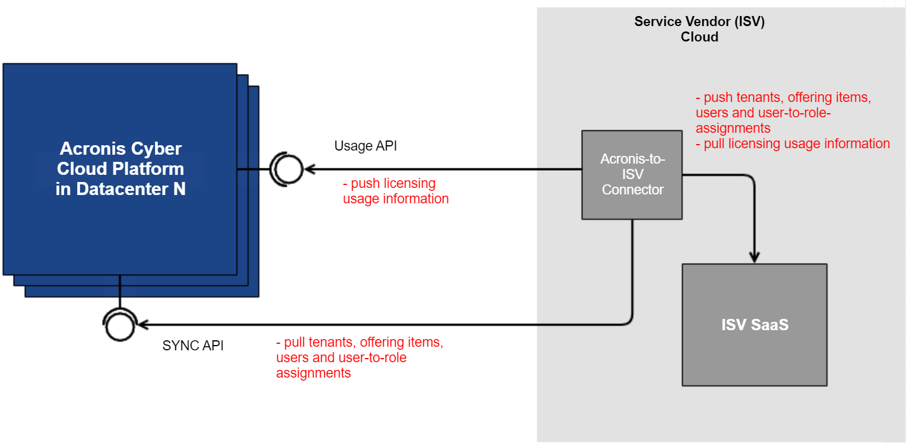

# acronis-cyber-cloud-go-sample-connector

Go implementation of sample connector between Acronis Cyber Cloud (ACC) Platform and Service Vendor (ISV) Cloud environment.

Connector polls SYNC API endpoints on ACC Platform to retrieve information about:
* Tenants
* Offering items
* Users
* Access policies (users-to-role-assignment)

These information will be pushed into ISV server (also referred as `external-system` throughout this document).

ISV developers can handle these information according to their business requirements by providing implementation of `ExternalSystemClient` interface, more details about this on `Providing implementation of external-system` section.

In addition, Connector also pulls `licensing usage` information from ISV Cloud environment and push them into ACC Platform via Usage API endpoint.



## Repository layout
```
connector
|--accclient                # client code package to call ACC Platform API endpoints for connector-related logic
|--core                     # contains interfaces definition, not needed to be modified for majority of cases.
   |__updater               # contains connector core logic to get information from ACC Platform and push them into ISV environment, not needed to be modified for majority of cases.
|--logs                     # contains logger interface that can be used to implement alternative logger. Default logger is logrus
|--sample-connector         # contains configuration file and main program of connector
   |__external              # package that contains sample implementation of `ExternalSystemClient` to push information to ISV environment. ISV developers should provide their implementation accordingly.
|--tests                    # contains integration tests code
|--external-system          # contains sample implementation of external-system
|--vendor                   # vendor code
|--connector.Dockerfile     # dockerfile for connector service in docker
|--docker-compose.ci.yaml   # docker compose override file running unit test in continuous integration environment
|--docker-compose.e2etest.yaml  # docker compose override file for running integration test
|--docker-compose.override.yaml # default docker compose override file, usually used in local dev environment
|--docker-compose.yaml     # base docker compose file to deploy connector, external-system and postgres database in dockers
|__external-system.Dockerfile   # dockerfile for external-system deployment in docker
```


## Requirements
* Golang version 1.15+
* Docker
* Docker-compose

## Prerequisites
1. Provide Acronis datacentre URL in `baseURL` field in `connector/sample-connector/config.yaml`
2. Perform manual registration with Acronis cloud to get clientID and clientSecret (Required in `.env` file or pass in as environment variables. Refer to [Starting the applications](#starting-the-applications) on how to setup)
3. An `external-system` server that will accept data flow (tenants, offering items, users and access policies) from connector. This repo contains a sample implementation of `external-system`, refer to subsequent section to provide new implementation.

## Providing implementation of `external-system`
1. Provide implementation of `ExternalSystemClient` interface defined in `connector/core/external.go`
    * The interface consists of 5 sections, namely to process `tenants`, `offering items`, `users`, `access policies` and `usages`
    * In general, each section should implement application logic to handle when an object is created or modified (upsert operation) and when an object is deleted.
    * For `usages`, ISV developers should provide implementation on how to retrieve usages from ISV environment. Connector will push these information into ACC Platform.
2. `Connector` communicates with `external-system` via REST API calls. Address of `external-system` can be provided via `externalSystemURL` field in `connector/sample-connector/config.yaml`
3. Provide the new implementation into `Main` function located in `connector/sample-connector/main.go`, specifically, modify the following code section:
```
// Setup client for external system
extClient := extclient.NewClient(http.DefaultClient, config.ExternalSystemURL)
externalClient := external.NewExternalSystem(extClient)

// Run updater
coreUpdater := updater.NewUpdater(config.UpdaterSettings, externalClient)
```

## Starting the applications

To run the sample applications in one docker setup, run `make -B deploy`
This command will deploy the following 3 docker containers:
1. sample-connector
2. external-system
3. postgres database instance

To run only the sample-connector in docker while running postgres and external-system separately:
1. Update the host url to postgres and external-system in sample-connector's [config file](connector/sample-connector/config.yaml)
2. Create the environment file `.env` at the project root directory with Make command.
  ```
  make -B .env
  ```
3. Update the variables accordingly. Example:
  ```
  # This authentication details are needed to communicate with Acronis Cloud datacentre
  # ClientID and ClientSecret should be obtained after registration to Acronis platform
  AUTH_CLIENT_ID=<REPLACE WITH CLIENT ID>
  AUTH_CLIENT_SECRET=<REPLACE WITH CLIENT SECRET>

  # Database credentials for external system
  DB_USER=postgres
  DB_PASSWORD=<REPLACE WITH DATABASE PASSWORD>

  # Assigned ID for the application for SSO.
  SSO_AUTH_CLIENT_ID=<REPLACE WITH SSO CLIENT ID>
  # Assigned secret for the application for SSO.
  SSO_AUTH_CLIENT_SECRET=<REPLACE WITH SSO CLIENT SECRET>

  # Secret use in initializing session store.
  SSO_AUTH_SESSION_SECRET=<REPLACE WITH A SECRET STRING>
  ```
4. Build and run sample-connector in docker
  ```
  docker build -f connector.Dockerfile -t sampleconnector .
  docker run -it --rm -d --name sampleconnector sampleconnector ./connector/connector -config ./connector/sample-connector/config.yaml
  ```

### Stopping the applications

You can stop the running services by executing the following command
```
make -B stop
```

## Running integration (end-to-end) tests
**Important**: Only run this integration test on Acronis sandbox DC because it requires creation of test tenant and user.
We provide some basic integration test scenarios to verify that connector is able to sync information correctly from ACC Platform to ISV environment.
### Prerequisites to run integration tests
1. Create a `Partner` account in Acronis cloud which will act as parent tenant of test tenant that will be created by test logic
2. Ensure the necessary config values for connector in `connector/sample-connector/config.yaml` and `.env` have been provided as specified in `Prerequisites` section
3. Provide values for integration test config in `connector/tests/tools.go`:
  * Create an API Key from Partner account created in step 1 and get the `clientID` and `clientSecret` values
  * Datacentre URL in `dcURL` field
  * Provide the type of ISV application in `applicationType` field
  * Provide the list of ISV offering item names in `offeringItemNames` field
  * Provide the name of ISV administrator role in `roleName` field
  * Update value of `externalSystemURL` in `connector/tests/tools.go` if the URL of external-system is changed.

### Command
1. Run `make -B e2etest`
    * This command will run 3 dockers mentioned in `Starting the applications` section and test stub in another docker container.
    * The test stub will create tenant and user in Acronis cloud and verify they are being synced accordingly into `external-system`.
    * Subsequently, the test stub will remove these tenant and user from Acronis cloud and verify they are being removed accordingly from `external-system`.
    * Note that the test code in `connector/tests` directory need to be adjusted accordingly once new implementation of `external-system` is provided by ISV developers.
2. Successful test will output the following lines
```
=== RUN   TestTenantAndOfferingItems
--- PASS: TestTenantAndOfferingItems (32.97s)
=== RUN   TestUserAndAccessPolicy
--- PASS: TestUserAndAccessPolicy (31.83s)
PASS
ok      <truncated_path>/connector/tests    64.804s
```

## Running unit test
Run `make -B test`

## Dependencies Management
This repository is using Go Modules to handle its dependencies (https://golang.org/ref/mod)
In summary:
1. Add new dependency with `go get`
1. Run `go mod tidy` to remove unused dependencies from `go.mod` and `go.sum`
1. Run `go mod vendor` to add the packages in to `vendor` folder (and removed unused packages from `vendor` folder)

*© 2003-2022 Acronis International GmbH. This source code is distributed under MIT software license.*
